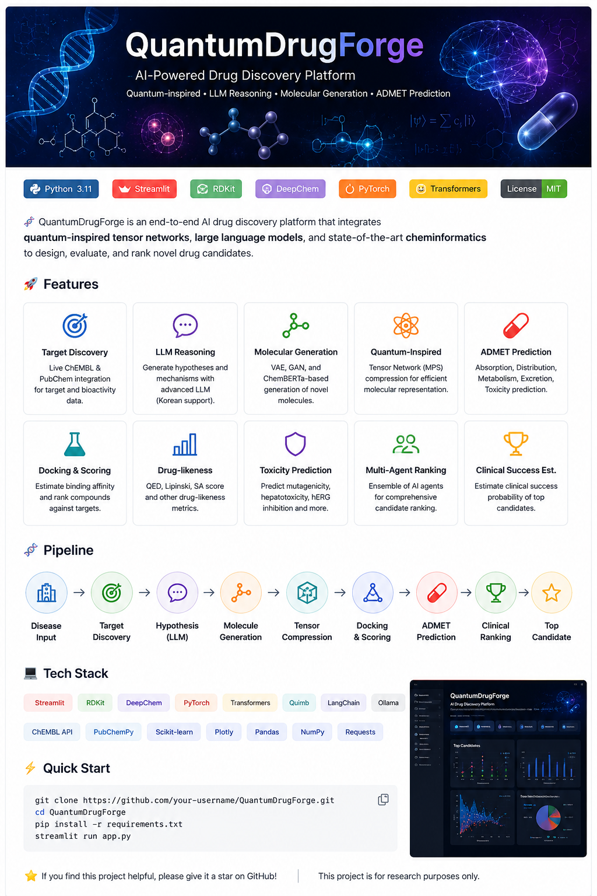

<p align="center">



</p>

<h1 align="center">🧬 QuantumDrugForge</h1>

<p align="center">

<b>Quantum-inspired AI Drug Discovery Platform</b>

</p>

<p align="center">


</p>

---

# 🇰🇷 한국어

## QuantumDrugForge란?

QuantumDrugForge는 **인공지능 기반 신약 후보물질 탐색 플랫폼**입니다.

실시간 생명과학 데이터베이스와 AI 모델을 결합하여 질병에 대한 치료 타겟을 탐색하고,
새로운 분자를 생성하며,
약물 가능성을 평가하는 연구 플랫폼입니다.

본 프로젝트는 다음 기술들을 하나의 파이프라인으로 통합합니다.

- 🧬 ChEMBL 실시간 약물 데이터
- 🔬 PubChem 화합물 검색
- 🤖 LLM 기반 치료 가설 생성
- 🧪 분자 생성(VAE / GAN / ChemBERTa)
- ⚛️ Quantum-inspired Tensor Network
- 💊 ADMET 예측
- ☣️ 독성 예측
- 🧠 Multi-Agent Ranking
- 📊 임상 성공 가능성 평가

---

## 전체 파이프라인

```
Disease

↓

Target Discovery

↓

Hypothesis Generation

↓

Molecule Generation

↓

Quantum Tensor Compression

↓

Docking

↓

ADMET Prediction

↓

Clinical Ranking

↓

Top Drug Candidate
```

---

## 주요 기능

✅ 실시간 ChEMBL API 연동

✅ PubChem 데이터베이스 검색

✅ AI 기반 분자 생성

- Variational AutoEncoder
- GAN
- ChemBERTa

✅ Quantum-inspired MPS 압축

✅ Drug-likeness 평가(QED)

✅ Docking Score 계산

✅ ADMET 예측

✅ 독성 예측

✅ Scaffold Diversity 분석

✅ Multi-Agent Ensemble

✅ 임상 성공 가능성 예측

---

## 사용 기술

- Python
- Streamlit
- RDKit
- DeepChem
- PyTorch
- Transformers
- LangChain
- Ollama
- Quimb
- ChEMBL
- PubChem

---

# 🇺🇸 English

## What is QuantumDrugForge?

QuantumDrugForge is an **AI-powered drug discovery platform** designed to explore novel therapeutic compounds using modern artificial intelligence and computational chemistry.

The platform integrates real-world biomedical databases with multiple AI models to identify therapeutic targets, generate candidate molecules, evaluate drug-likeness, predict ADMET properties, and rank promising compounds.

The system combines:

- 🧬 Live ChEMBL Integration
- 🔬 PubChem Search
- 🤖 LLM-based Scientific Reasoning
- 🧪 Molecular Generation (VAE / GAN / ChemBERTa)
- ⚛️ Quantum-inspired Tensor Networks
- 💊 ADMET Prediction
- ☣️ Toxicity Prediction
- 🧠 Multi-Agent Reasoning
- 📊 Clinical Success Estimation

---

## Pipeline

```
Disease

↓

Target Discovery

↓

Hypothesis Generation

↓

Molecule Generation

↓

Quantum Tensor Compression

↓

Docking

↓

ADMET Prediction

↓

Clinical Ranking

↓

Top Drug Candidate
```

---

## Features

- Live ChEMBL Integration
- PubChem Integration
- AI Molecular Generation
- VAE
- GAN
- ChemBERTa
- Quantum-inspired Tensor Compression
- Drug-likeness Prediction
- Docking Simulation
- ADMET Prediction
- Toxicity Prediction
- Multi-Agent Ranking
- Clinical Success Estimation

---

## Technology Stack

- Python
- Streamlit
- RDKit
- DeepChem
- PyTorch
- Transformers
- LangChain
- Ollama
- Quimb
- ChEMBL
- PubChem

---

## Installation

```bash
git clone https://github.com/YOUR_USERNAME/QuantumDrugForge

cd QuantumDrugForge

pip install -r requirements.txt

streamlit run app.py
```

---

## Disclaimer

This project is intended **for research and educational purposes only**.

The generated molecules, predictions, and rankings **must not** be interpreted as validated drug candidates or clinical recommendations without further experimental and clinical verification.

---

⭐ If you like this project, please consider giving it a Star!
